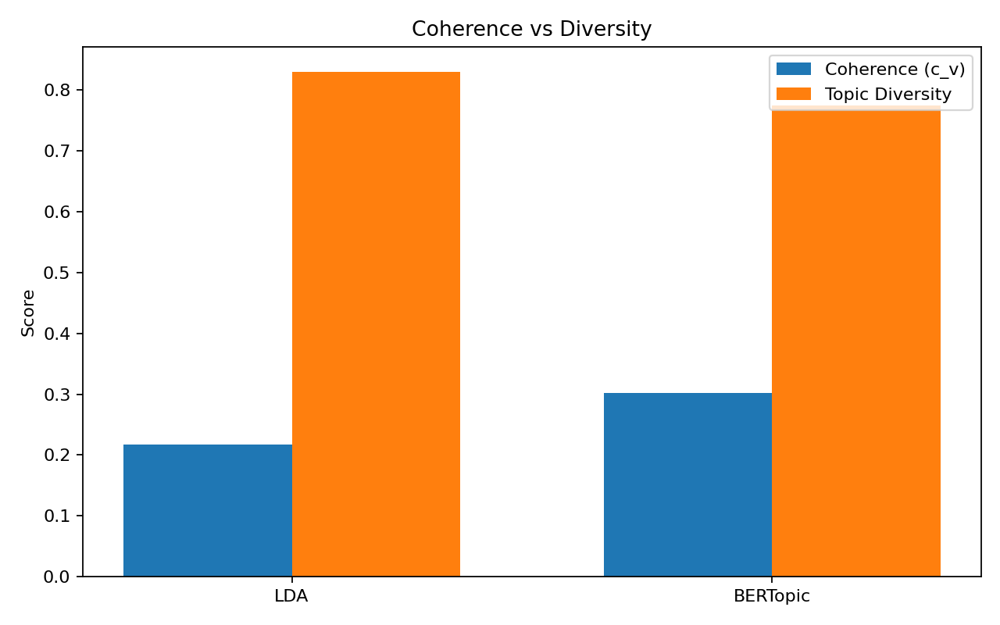

# TextKD — P2 Topics (LDA vs BERTopic)


A little **baseline for topic modeling** that compares a **classic** approach (**LDA**) with a **contextual** one (**BERTopic**).  
It runs on **20 Newsgroups**, computes **topic coherence (c_v)** and **topic diversity**, and saves **metrics** and **topic tables**.

## TL;DR

> Python 3.13 note
> To avoid optional native deps (UMAP/HDBSCAN/numba), install a lightweight stack:
> 
> ```bash
> pip install -r requirements.txt        # core deps (no umap/hdbscan)
> pip install --no-deps bertopic         # install BERTopic without pulling optional deps
> ```
> 
> This project configures BERTopic to use **PCA + KMeans** instead of UMAP/HDBSCAN,
> and computes a lightweight **NPMI coherence** (the JSON key stays `coherence_c_v` as a proxy).


macOS / Linux
~~~bash
python3 -m venv .venv && source .venv/bin/activate
pip install -r requirements.txt

# Quick demo (small subset, faster)
python src/train.py --fast

# Full run
python src/train.py
~~~

Windows (CMD)
~~~bat
python -m venv .venv && .\.venv\Scripts\activate.bat
pip install -r requirements.txt

REM Quick demo (small subset, faster)
python src\train.py --fast

REM Full run
python src\train.py
~~~

## Data

- Uses **20 Newsgroups** from scikit-learn (auto-downloaded on first use). No manual data handling.
- `--fast` limits categories and samples (configurable in `configs/default.yaml`) to keep runtime light.

## Outputs

- `results/metrics.json` → key metrics for **LDA** and **BERTopic**:  
  - `coherence_c_v` (higher is better),  
  - `topic_diversity` (unique words / total topic words),  
  - `n_topics` and `train_seconds`.
- `results/topics/lda_topics.csv` and `results/topics/bertopic_topics.csv` → topic tables (id, top words).
- `results/plots/coherence_vs_diversity.png` → bar chart comparing coherence & diversity.

## Acceptance (MVP)

- One command runs end-to-end on a subset in < 10 minutes (`--fast`).
- Clear README with steps and outputs.
- Reproducible `metrics.json` + at least one plot and two topic tables under `results/`.

## Results (full run)

Setup: Python **3.13**, 20 Newsgroups (full dataset).  
Config highlights: `pca_n_components=10`, `kmeans_n_clusters=16`, `min_topic_size=15`, `top_n_words=10`, embedding=`all-MiniLM-L6-v2`.

> **Coherence note.** We compute a lightweight **NPMI coherence** to stay NumPy/Scikit-only on Python 3.13.  
> The JSON key remains `coherence_c_v` for consistency, but it is an NPMI proxy here.

| Model     | Coherence (NPMI proxy) | Topic Diversity | #Topics |
|-----------|------------------------:|----------------:|-------:|
| LDA       | **0.3345**              | **0.8300**      |   10   |
| BERTopic  | **0.3584**              | **0.7938**      |   16   |

Numbers sourced from `results/metrics.json`. :contentReference[oaicite:1]{index=1}



### Reproduce
```bash
# fresh venv recommended
pip install -r requirements.txt
pip install --no-deps bertopic
python src/train.py --fast
# metrics: results/metrics.json
# topics:  results/topics/{lda_topics.csv, bertopic_topics.csv}
# plot:    results/plots/coherence_vs_diversity.png
```

## Project structure
~~~text
repo/
├─ README.md
├─ requirements.txt
├─ .gitignore
├─ configs/
│  └─ default.yaml
├─ src/
│  ├─ data.py
│  ├─ utils.py
│  └─ train.py
└─ results/
   ├─ plots/
   └─ topics/
~~~

## License

MIT — see `LICENSE`.
